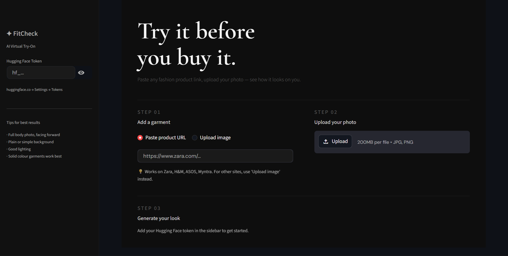
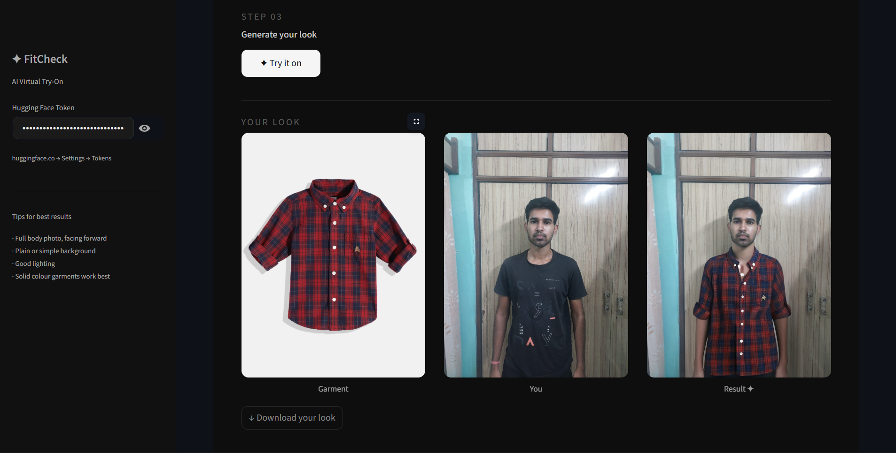

# ✦ FitCheck — AI Virtual Try-On

> Paste any fashion product link. Upload your photo. See how it looks on you.
> > Currently runs locally — deployment coming soon.

## Screenshots



---

## What it does

FitCheck is an end-to-end AI virtual try-on web app. It scrapes a garment image from any fashion product URL, takes a photo of you, and uses a diffusion-based AI model to realistically overlay the garment onto your body.

No app download. No size guessing. Just paste, upload, and see.

---

## How it works

```
Product URL  ──►  Web Scraper  ──►  Garment Image
                                          │
                  User Photo  ───────────►│
                                          ▼
                                    IDM-VTON Model
                                    (Hugging Face)
                                          │
                                          ▼
                                   Result Image ──► Download
```

1. **Scraper** — fetches the product page, extracts garment image via Open Graph meta tags
2. **Upload fallback** — for sites that block scraping (Ajio, GAP, Amazon), user uploads the garment image directly
3. **Try-On Model** — IDM-VTON diffusion model warps the garment to the person's pose and generates the final output
4. **UI** — clean dark-themed Streamlit app, runs locally

---

## Tech stack

| Layer | Technology |
|---|---|
| Language | Python 3.12 |
| UI | Streamlit |
| Scraping | BeautifulSoup4, Requests |
| Image processing | Pillow (PIL) |
| Try-on model | IDM-VTON via Hugging Face |
| API client | Gradio Client |

---

## Getting started

### 1. Clone the repo
```bash
git clone https://github.com/yourusername/fitcheck.git
cd fitcheck
```

### 2. Create and activate a virtual environment
```bash
python -m venv venv

# Windows
venv\Scripts\activate

# Mac/Linux
source venv/bin/activate
```

### 3. Install dependencies
```bash
pip install -r requirements.txt
```

### 4. Run the app
```bash
streamlit run app.py
```

Open [http://localhost:8501](http://localhost:8501) in your browser.

### 5. Add your Hugging Face token
- Get a free token at [huggingface.co/settings/tokens](https://huggingface.co/settings/tokens) — Read access is enough
- Paste it in the sidebar when the app opens

---

## Usage

1. **Step 01** — Paste a fashion product URL or upload a garment image directly
2. **Step 02** — Upload a clear full-body photo of yourself
3. **Step 03** — Hit **✦ Try it on** and wait 30–60 seconds
4. Download your result

### Tips for best results
- Full body photo, facing forward
- Plain or simple background
- Good lighting
- Solid colour garments work better than complex prints

---

## Supported sites

**URL scraping works on:**
Zara, H&M, ASOS, Myntra, Meesho, Uniqlo

**Sites that block scraping (Ajio, GAP, Amazon, Flipkart):**
Use the image upload option — right-click the product photo on the website → Save image → Upload it in the app

---

## Project structure

```
fitcheck/
├── app.py              # Main app — scraper + try-on pipeline + UI
├── requirements.txt    # Python dependencies
├── .gitignore          # Ignores venv, output folder, secrets
├── README.md           # This file
├── screenshot.png      # App screenshot
└── output/             # Saved images — git ignored
```

---

## Limitations

- Try-on quality depends on image clarity and garment complexity — solid colours work best
- Some sites block scraping; use the image upload fallback instead
- Inference takes 30–60 seconds depending on Hugging Face server load
- Works best with upper body garments

---

## What's next

- [ ] Video try-on — process a short clip frame by frame
- [ ] Real-time AR overlay using MediaPipe body pose estimation
- [ ] Size recommendation based on body measurements
- [ ] Support for lower body garments
- [ ] Mobile-optimised UI
- [ ] FastAPI backend + React frontend for production

---

## Built with

- [IDM-VTON](https://huggingface.co/spaces/yisol/IDM-VTON) — open source diffusion-based virtual try-on model
- [Streamlit](https://streamlit.io) — web app framework
- [Hugging Face](https://huggingface.co) — model hosting

---

## Author

**Harshvardhan**
Computer Science Graduate

[GitHub](https://github.com/Harshingh) · [LinkedIn](https://www.linkedin.com/in/harsh-vardhansingh/)
